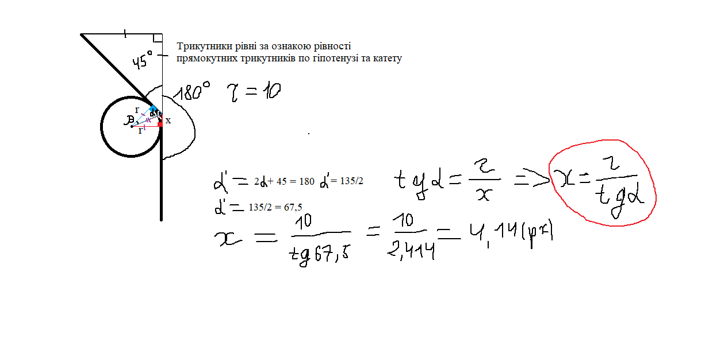

<h1 align="center">СV</h1>

<div align="center"><a href="https://resum.online">Вы можете увидеть сайт-резюме по ссылке</a></div>

## Запуск проекта на локальком сервере
**Вы можете копировать код с моего репозитария и использовать для своих проектов**

Вы можете скачать zip архив с репозитарием сайта, распаковать его в удобное место, запустить файл index.html

## Процесс создания сайта

* исследование области (ссылка на сайты примери резюме для IT)
  - ссылка 1
  - ссылка 2
* создание прототипа в Figma(ссылка)(фото)
* frontend разработка (фото)
* тестирование функций
* исправление ошибок
* создание readme файла
* релиз сайта

### online
On the site you can see my knowledge in web development.
I will persevere to improve my skills.
The result of my work can be seen on github.
If you have any suggestions or comments please email me. 

**this is bold text**
*this is italic text* 
regular text

***this text isnt `modify` in other text***


Some basic Git commands are:
```
git status  
git add
git commit
```
The background color should be `#ffffff` for light mode and `#0d1117` for dark mode.

https://docs.github.com/ru/get-started/writing-on-github/getting-started-with-writing-and-formatting-on-github/basic-writing-and-formatting-syntax

[my link](https://google.com)




